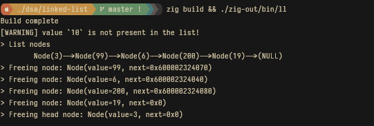

# Linked List

A naive linked-list implementation for DSA class (does not follow class approach 1:1). I have commented parts I remembered to comment but the code should be straight-forward.



## Running
You need the [Zig](https://ziglang.org) toolchain instead, it is my preferred build tool for this and other C++ projects.

```sh
zig build && ./zig-out/bin/ll
```
